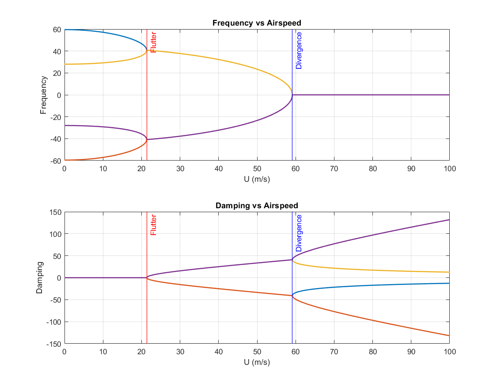
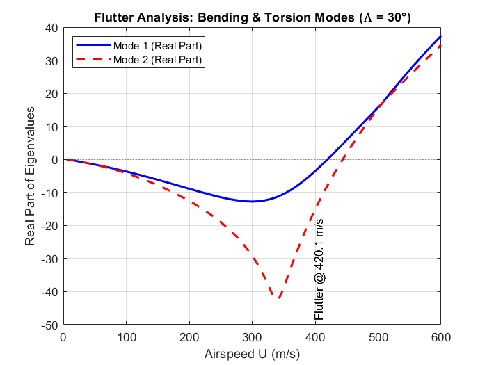
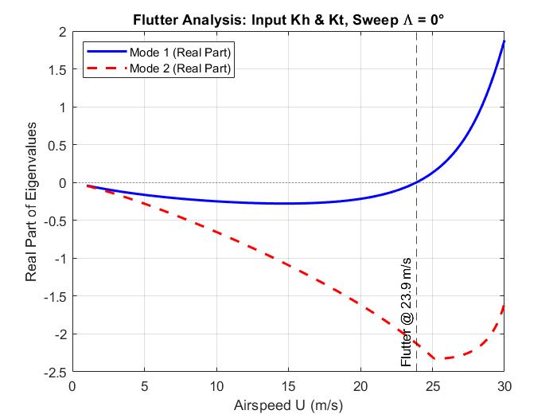
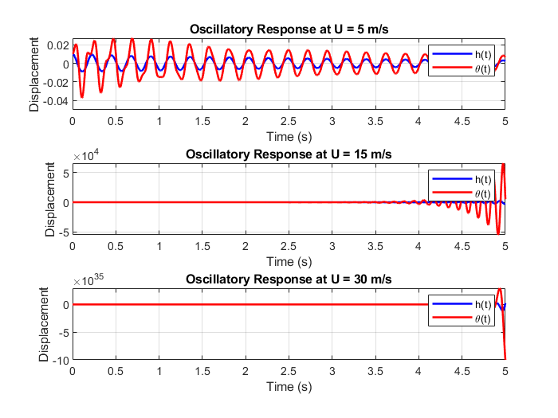
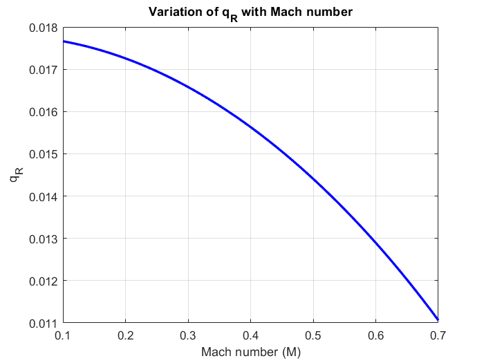
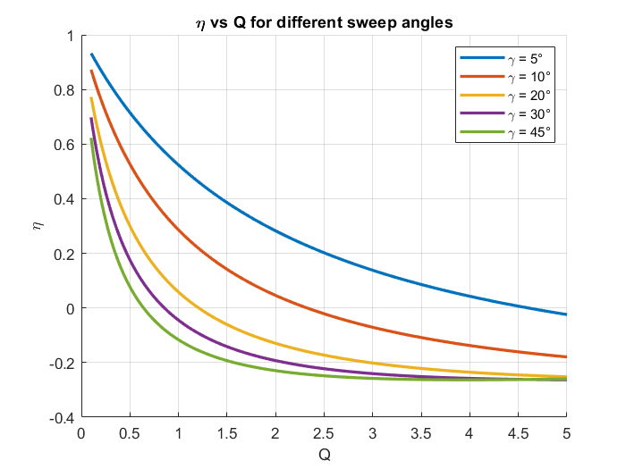
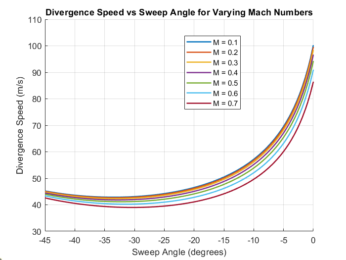

# Divergence and Flutter Analysis of Airfoil and Wing
This repository contains MATLAB scripts for the aeroelastic analysis of airfoils and wings, focusing on the phenomena of divergence and flutter. The project uses analytical and numerical methods to predict critical speeds and understand the behavior of aeroelastic systems under various conditions.

## Project Summary
This project involves the development of a suite of MATLAB tools to perform a comprehensive aeroelastic analysis. Key achievements include:

- **Divergence Analysis**: Computing the divergence velocity and pressure for both airfoil and continuous wing sections using a combination of analytical and numerical techniques.

- **Flutter Prediction**: Developing a MATLAB tool for flutter prediction based on the V-g method. This tool incorporates fully unsteady aerodynamic loads and generates frequency and damping plots as a function of airspeed.

- **Parametric Studies**: Evaluating the effects of key design parameters, such as sweep angle, control surfaces, and aeroelastic tailoring, on the flutter and divergence characteristics of the wing.

## MATLAB Scripts
The project is organized into several MATLAB scripts, each addressing a specific aspect of the aeroelastic analysis.

- **flutter_real.m**: This script performs a flutter analysis for a continuous wing model, specifically a Goland wing, with a focus on bending and torsion modes. It uses the Theodorsen function approximation to model unsteady aerodynamics and a state-space formulation to solve for eigenvalues, which represent the system's stability. The script also includes a parameter for varying the wing's sweep angle.

- **model1_2_3.m**: This script provides a more general framework for flutter analysis of a 2-DOF airfoil section (plunge and pitch). It allows for the selection of three different aerodynamic models:

  - Model 1: Quasi-static

  - Model 2: Quasi-static with aerodynamic damping

  - Model 3: Quasi-steady unsteady aerodynamics (with non-circulatory added mass)

The script iterates through a range of airspeeds to calculate the damping and frequency of each mode, ultimately determining the flutter and divergence speeds.

- **flutter_real_discrete.m**: This script performs a flutter analysis on a discrete airfoil model, similar to model1_2_3.m, but is structured to accept discrete stiffness and mass properties. It also incorporates non-circulatory and circulatory aerodynamic terms and a state-space formulation for stability analysis.

- **amplitude_vs_U.m**: This script simulates the time-domain oscillatory response of a 2-DOF airfoil at different airspeeds. It uses a state-space formulation and the ode45 solver to numerically integrate the equations of motion. The script demonstrates the transition from a stable, damped response to an unstable, divergent response as airspeed increases past the flutter speed.

- **qRwithMachNo.m**: This script performs study for showing variation of reversal dynamic pressure with varying Mach number.

- **SweepEffectiveness.m**: This script shows effectiveness for varying divergence ratio for different values of sweep angles.

- **DivergenceVsSweepforMach.m**: This script shows variaion of Divergence speed with sweep angle for different Mach number values.

## Key Parameters and Results
The scripts were run with specific values to demonstrate their functionality. Below are some of the key results and the values used for the calculations.

- **model1_2_3.m** - Model 1 (Quasi-Static)
For the quasi-static model, the following critical speeds were computed:

  

  - Divergence speed: **59.15 m/s**

  - Flutter speed: **21.35 m/s**

The output plots for this model, and the flutter_real_discrete.m and flutter_real.m scripts, show the real part of the eigenvalues (damping) versus the airspeed. The point where the real part of an eigenvalue crosses the zero line from negative to positive indicates the onset of instability (flutter).

- **flutter_real.m** (Goland Wing)
This script, when run with a sweep angle of **30 degrees** and the specified Goland wing parameters, produced a flutter speed of approximately **420.1 m/s**.

  

- **flutter_real_discrete.m** (Discrete Airfoil)
Using the parameters specified in the script, the flutter speed was found to be approximately **23.9 m/s**.

  

The flutter_real_discrete.m and flutter_real.m scripts both implement fully unsteady loads based on the Theodorsen theory and use a method similar to the V-g method for solving the aeroelastic equations.

- **amplitude_vs_U.m** (Time-Domain Response)
This script was used to simulate the oscillatory response at three different airspeeds, demonstrating the change in system stability:
  

  - U = 5 m/s: The response shows a stable, damped oscillation.

  - U = 15 m/s: The oscillations are still damped but take longer to die out, indicating reduced stability.

  - U = 30 m/s: The response becomes unstable, with the amplitude of oscillation growing rapidly, confirming that the system is operating past its flutter speed.

## Parametric Studies
In addition to the primary analysis, several parametric studies were conducted to understand the impact of various design parameters on the aeroelastic behavior of the wing. These studies include:

- **Variation of Reversal Dynamic Pressure with Mach Number**: A study on how the dynamic pressure at which aileron reversal occurs changes with increasing Mach number.

  

- **Lift Effectiveness with Different Sweep Angles**: An analysis of the effect of wing sweep on the lift effectiveness, demonstrating how sweep can alter the aeroelastic behavior.

  

- **Divergence Speed vs. Sweep Angles for Varying Mach Number**: A comprehensive study that plots the divergence speed against the wing sweep angle, showing how this relationship is influenced by different flight Mach numbers.

  

## Getting Started
To run these scripts, you will need a MATLAB environment.

1. Clone this repository to your local machine.

2. Open the desired MATLAB script (.m file) in the MATLAB editor.

3. Modify the parameters in the "USER INPUT" or "Wing Parameters" sections of the script as needed.

4. Run the script. The output will include command-line messages and plots showing the frequency and damping as a function of airspeed.

---

*Note: This project was developed as a self-study exercise in May 2025. The models and approximations used are for educational purposes.*
